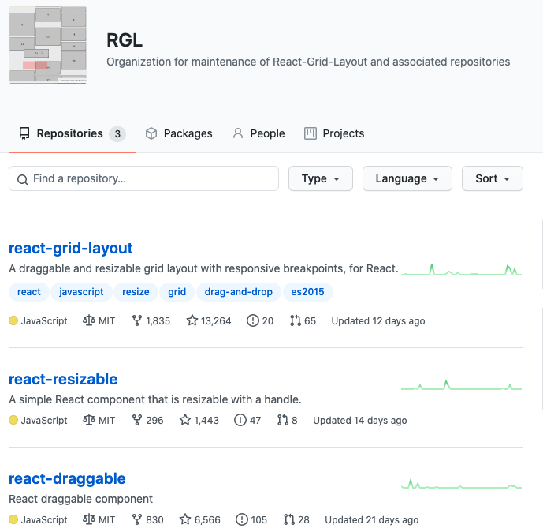

# big-go

Empty project.

## Building and running on localhost

First install dependencies:

```sh
npm install / yarn
```

To run in hot module reloading mode:

```sh
npm start
```

To create a production build:

```sh
npm run build
```

## Running

Open the file `dist/index.html` in your browser

## Testing

To run unit tests:

```sh
npm test
```

## Credits

Made with [createapp.dev](https://createapp.dev/)

## build
how to measure the speed, we can see the flowing [speed-measure-webpack-plugin](https://github.com/stephencookdev/speed-measure-webpack-plugin)

## we need three webpack-config files 
1. the base 
2. the production
3. the development
if we use only one ,we should write many `if else` according to the `process env`,this is the reasons

## webapck 构建速度优化
1. 在webconfig 没有拆成三个之前，项目的构建(build)耗时在50多秒，热更新速度在二三十秒
2. 在拆完之后，build耗时直接降为16s;热更新启动不超过1s,大大的提升了性能
3. 这次实践证明确实我们的webconfig 拆为三个配置文件具有更好的维护性和性能提升
   

## 关于使用react-dnd 来完成组件拖拽
1. 首先解释一下 react-dnd 的英文全称：Drag and Drop for React
2. 这个开源组件可以为我们带来什么，解决什么问题?

```js
// 用这个库最好先看一下这个库的overview，能够理解overview 所说的 item 和 type 的含义，以及react-dnd 是基于数据对象而不是视图实现拖拽
// 关于这个useDrag 的hooks,这个hooks 用在被拖拽组件之上
const [{ isDragging }, dragRef] = useDrag({
    item: {
      type: "card",
    },
    collect: (monitor) => ({ // 一个收集器，监听你所拖动的组件是拖放中还是释放了
      isDragging: monitor.isDragging(),
    }),
  });

// 关于这个useDrop ,用来支持拖放源放置被拖放组件，放在画布容器上
const [{ isOver }, dropRef] = useDrop({
    accept: "card",
    drop: () => moveCard(), // 拖拽完成触发，这个函数是被包裹组件的外置api 
    collect: (monitor) => ({
      isOver: !!monitor.isOver(),
    }),
  });

```

## 如何根据json schema 来render我们的组件（dom）
1. 借助 React.createElement(),我们可以构造符合业务的 json ，然后通过React.createElement()输出我们想要的dom
2. 拖拽组件其实本质上我们是在画布上更新 props data , F(json)=>UI 思路就是这样

## 关于画布网格和坐标体系
- 网格先用css实现，至于坐标系我们就只能上canvas了
- 后期我们可能会上canvas画网格，然后做自动吸附

## 关于使用 React-Resizable , React-Grid-Layout , react-draggable
- 他们三个库是如何配合，各个库承担着什么角色
- 1. React-Resizable：React-resizable is a simple component that you wrap your existing components inside. It gives those components resize handles
     没错,这个家伙就是可以帮助我们改变组件大小的，通过鼠标的拖拉，进行放大缩小，这在可视化搭建是个很常见的需求
- 2. React-Grid-Layout：网格响应式布局，支持断点布局或者自动生成
- 3. react-draggable : 拖拽，可以监听到响应事件并执行回调
- 4. 你可能很奇怪为啥单独把这三兄弟拎出来，因为他们出自同一个organization 

## 关于右键菜单库 react-contexify 
-[react-contexify](https://github.com/fkhadra/react-contexify)

## 关于键盘快捷键库 - 还在调研中

## 关于物料组件库的设计思路
之前一直在想，我们直接把组件库往物料区块上放，然后直接将组件放入到画布中，这样很多配置项就不能拿到
我们把标准化的每一个组件库，配置schema , 通过json schema 拿到相关配置项，进而进入表单渲染
再将props 注入到组件，然后更新画布渲染。

## 物料库的模版和组件如何映射，这个是问题

## 关于yarn 和 npm 来回切换安装依赖导致yarn start 启动失败的问题
建议统一用yarn 来安装相关包，否则需要重新 yarn 再启动 

## 监听键盘事件
- keymaster []

## 拖拽引起的撤销和重做的需求
- 最暴力的方式肯定是命令式的用一个数组存，更优雅的方式是快照式存储用户操作，这里直接用的redux-undo
- redo 重做; undo 撤销
- 突然要引进redux,我觉得需要写太多模版代码了，实际上我们使用 useReducer 和 immer
- useReducer 可以更改state 数据
- immer 用于生成不可变数据结构
目前web做撤销和重做的两种方式：
a. 命令式，每次操作都写逆向操作操作方法，每次都保存正向和逆向两个操作，缺点：尤其维护性不好；优点：易于理解
b. 快照式，每次操作保存每次的操作数据，每一次恢复都是一次页面数据的重置，类似git

需要注意的点：
1. 撤销操作之后，如果还进行了新的操作，那么恢复到那次的操作之后的数据都会丢失掉。